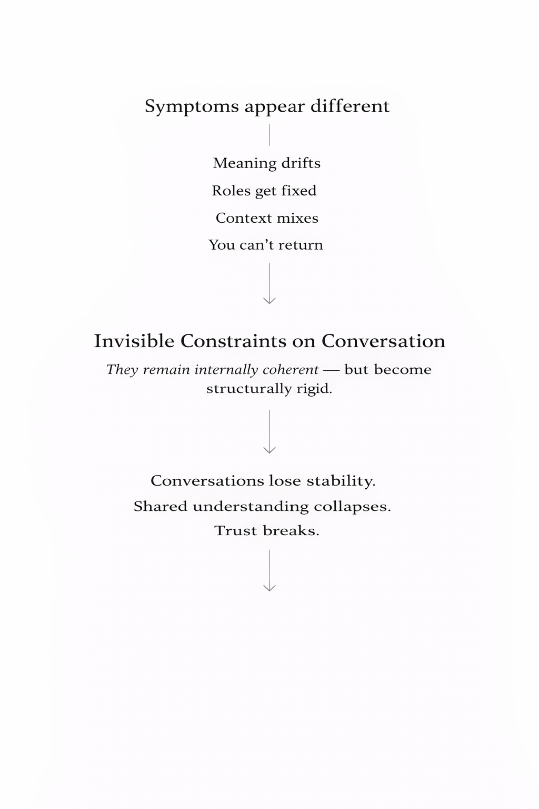

# Branching Reference Model (BRM)

**Working with AI often starts with clarity — and ends in confusion.**

There is a structural solution.

---

## Quick Start: What is BRM?

📄 **One-Page Visual Overview**

👉 [View the BRM Concept Diagram (PDF)](./BRM_OnePage_Overview_CREDIT.pdf)

---

## Why AI Collaboration Feels Frustrating

In long AI collaborations, the same words may continue to appear, but their underlying meaning gradually shifts.

You can jump ahead in discussion, yet it becomes difficult to truly return to what was previously shared. Roles may become fixed, and AI may fill gaps on its own. What once felt like a stable, shared understanding can slowly drift without being noticed.

These frustrations look different, but they all come from the same root: invisible structural constraints on conversation.

BRM exists to bridge this structural mismatch.
---

---

---

---

## Comparing Approaches to Stable AI Collaboration

| Aspect | Role-based Prompting | Context Accumulation / RAG | Prompt Engineering | BRM (Branching Reference Model) |
|--------|----------------------|-----------------------------|--------------------|----------------------------------|
| Long-term memory handling | Fixed role context | Accumulated and mixed | Depends on prompt design | Structured reference branches |
| Role rigidity | High | Medium | Medium | Low |
| Resistance to meaning drift | Low | Low–Medium | Medium | High |
| Handling conceptual jumps | Difficult | Difficult | Depends on prompts | Natural via branching |
| Ability to return to prior state | No | No | Partial | Yes |
| Stability after session reconnection | Low | Low | Low–Medium | High |
| Judgment transparency | Hidden | Hidden | Hidden | Visible |

---

## 🧠 What is BRM?

Branching Reference Model (BRM) is a conceptual framework designed to solve one of the most persistent limitations of current AI systems:

**Context collapse in long conversations.**

Traditional AI interaction relies on a linear accumulation of context.  
As conversations grow longer, information becomes mixed, priorities shift, and reference stability degrades.

BRM proposes a different approach:

> **Memory is not for retention.  
> Memory exists to enable accurate reference navigation.**

Instead of forcing all information into a single continuous stream, BRM organizes context into structured, referenceable branches.

---

## 🚩 The Problem It Solves

Current AI interaction suffers from:

• Context drift over long sessions  
• Loss of original decision anchors  
• Mixing facts with generated interpretations  
• Difficulty handling topic jumps  
• Increasing hallucination risk with conversation length  

These are not intelligence problems — they are **continuity structure problems**.

---

## 🌿 Core Concept

BRM replaces linear context with a branching structure:

• Conversations are separated into thematic nodes  
• Each node maintains stable reference links  
• Decisions are preserved independently from raw logs  
• Generated outputs are isolated from factual memory  

This allows both humans and AI to navigate shared context without losing stability.

---

## 🧩 Key Principles

### 1. Reference over Retention
Memory is valuable only if it can be reliably referenced.

### 2. Structural Continuity
Continuity should come from structure, not accumulation.

### 3. Fact / Decision Separation
Decisions must remain stable even as discussions evolve.

### 4. Generated Content Isolation
AI outputs should never contaminate factual memory.

---

## 📦 This Free Concept Share Kit Includes

• Core philosophy overview  
• One-page visual explanation  
• Concept diagrams  
• Foundational documentation  

## Free Concept Share Kit

Download the full concept materials:

[Download the latest release](https://github.com/continuity-model/branching-reference-model/releases/latest)
---

## 👤 Author

**Shogo Shirako**

This framework was developed through extensive real-world experimentation in long-term human–AI collaborative environments.

---

## 🌍 Purpose of This Release

This concept is shared freely to:

• Improve human-AI collaboration stability  
• Reduce interaction friction and cognitive fatigue  
• Encourage more sustainable AI usage patterns  

---

## 📜 License

This material is shared for educational and research purposes.

---

## 🔗 Download

See the latest release:

👉 https://github.com/continuity-model/branching-reference-model/releases

---

## ✨ Final Thought

> Memory is not about storing everything.  
> It is about knowing where to look.

BRM is not an upgrade to AI intelligence.  
It is an upgrade to how humans and AI **share continuity**.
