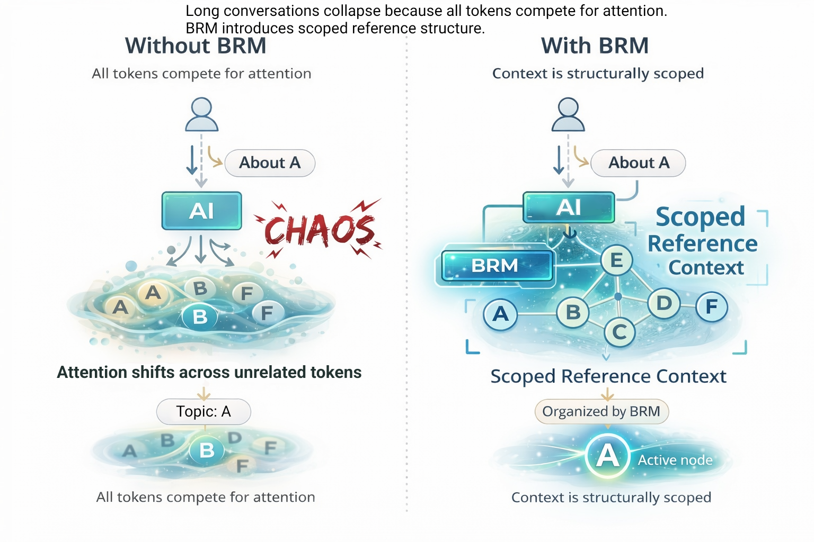

🌐 **Language / 言語**

- 🇺🇸 English (current)
- 🇯🇵 [日本語版はこちら](README_jp.md)

---

# Branching Reference Model (BRM)

AI conversations often collapse in predictable ways.

A structural model for stabilizing long AI conversations.

Long conversations often collapse because **all tokens compete for attention inside a single linear context**.

As discussions grow, references drift, assumptions blur, and reasoning paths interfere with each other.

BRM introduces a **scoped reference structure** designed to organize conversation context and preserve reasoning stability.

---

If you came here from X or Zenn:

AI conversations often fail in predictable ways:

- context drift  
- reasoning instability  
- prompt breakdown over time  

This is not random.

Start with a real example:

→ **[Case Study (see failure first)](case-studies/README.md)**

---

# BRM in 30 Seconds

Most AI workflows rely on **prompt control**:

Prompt  
↓  
Model  
↓  
Output  

Prompts can strongly influence the **initial response**.

However, during longer conversations their influence often weakens.

This repository refers to this phenomenon as **Prompt Dissolution** — the gradual weakening of prompt influence as conversational context expands.

As conversational context grows, model behavior may increasingly follow:

- conversational coherence  
- probabilistic completion  
- internal reference structures  

rather than the original prompt instructions.

The **Branching Reference Model (BRM)** explores a structural alternative.

Instead of relying solely on prompts, BRM investigates how **reference structures** may stabilize long interaction chains.

Prompt  
+ Structural Anchors  
+ Controlled Reference Scope  
↓  
Stable Long-Term Collaboration

**BRM organizes conversations into recoverable reference branches**, allowing reasoning paths to remain stable even as interaction history expands.

---

---

If you'd like to experience one of these structures in practice:

→ **[Download Symptom Stable v1.2](https://github.com/user-attachments/files/26179922/Symptom_Stable_v1_2_EN_Finalized.zip)**

If you want to understand why BRM exists:

→ **[Read the Origin Timeline](BRM_Origin_Timeline.md)**

---

## Start Here

If you're new, start with:

→ **[Case Study (Start Here)](case-studies/README.md)**

Then:

→ **[Stable Thinking Stack](core/EN/stable-thinking-stack.md)**

After that, explore freely.

---

👉 **Understand where BRM fits among prompts, RAG, and agents**  
→ [Concept Comparisons](./concept/)

---

# Why This Matters

Current AI systems reason over **linear conversational context**.

As interactions grow longer, this structure creates several problems:

- references drift across unrelated parts of the conversation  
- reasoning paths interfere with each other  
- important assumptions become diluted by unrelated tokens  

These effects often appear as:

- hallucinations  
- inconsistent reasoning  
- sudden loss of context  

However, many of these failures are **structural rather than purely model limitations**.

BRM proposes that stabilizing the **reference structure of conversations** can significantly improve long-term collaboration with AI systems.

Instead of treating conversation history as a single expanding stream, BRM introduces **structured reference organization**.

This allows reasoning paths to remain stable even as conversations grow large.

---

# Concept Overview

The Branching Reference Model separates three conceptual layers of AI collaboration:

Conversation Structure  
↓  
Reasoning Process  
↓  
Inference Engine  

In this view:

User interacts with the language model  
↓  
The **conversation context is organized using BRM reference structures**  
↓  
Stable Modes guide reasoning behavior  
↓  
The language model performs inference

BRM organizes the **structure of discussion**.  
Stable Modes guide **reasoning behavior**.  
The language model performs **inference**.

This separation allows reasoning strategies to evolve without destabilizing conversation structure.

---

# Repository Structure

This repository explores **structural failures in long AI collaboration** and proposes a model to address them.

Conceptual progression:

Observed collaboration failures  
↓  
Prompt dissolution  
↓  
Reference instability  
↓  
Stable reasoning environments  
↓  
Branching Reference Model

The repository contains two main parts:

• **Conceptual essays** describing observed structural issues in AI conversations  
• **The BRM core model** describing the proposed structural framework

---

# Essays

These essays explore structural issues observed in long AI conversations.

### AI Sees the Forest

→ Perspective differences between users and AI during reasoning  
→ **[Read essay](essay/EN/ai_sees_the_forest.md)**

---

### The Conversation Reference Problem

→ How reference drift appears in long AI conversations  
→ **[Read essay](essay/EN/ai_conversation_reference_problem.md)**

---

### Stable Environment and Perch

→ The idea of stabilizing reasoning through structured reference anchors  
→ **[Read essay](essay/EN/ai_stable_environment_and_perch.md)**

---

# Architecture Before Engine

→ Why structure may matter as much as model capability  
→ **[Read](core/EN/Architecture_Before_Engine.md)**

---

# Core Model

→ Formal definition of BRM primitives and structure  
→ **[BRM Core Model v2](core/EN/BRM_Core_v2.md)**

---

# Free Stable Mode (Symptom)

→ A practical entry point for structured reasoning  
→ **[Download Symptom Stable v1.2](https://github.com/continuity-model/branching-reference-model/releases/tag/symptom-stable-v1.2)**

---

# Explore Further

If you want to explore deeper:

- → [Concept Comparisons](./concept/)  
  Understand how BRM differs from prompts, RAG, and agents  

- → [Case Studies](case-studies/README.md)  
  See real examples of failure and structural recovery  

- → [Stable Thinking Stack](core/EN/stable-thinking-stack.md)  
  Apply structured reasoning in practice  

- → [BRM Core Model](core/EN/BRM_Core_v2.md)  
  Explore the formal structure and primitives  

- → [Architecture Before Engine](core/EN/Architecture_Before_Engine.md)  
  Understand the broader design philosophy  

---

# How to Read This Repository

Readers can explore freely after following the main path:

1. Case Study  
2. Stable Thinking Stack  
3. Structural Model  
4. Conceptual Exploration
