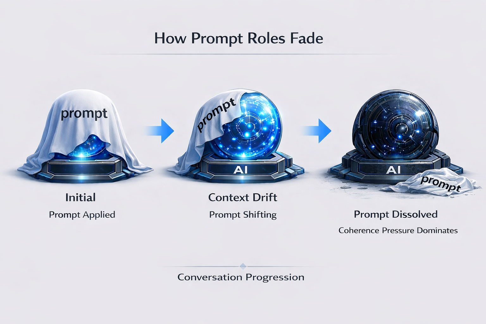
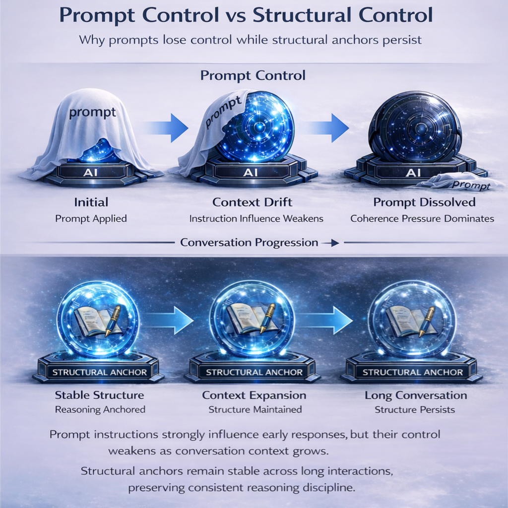

# Prompt Control vs Structural Control
Why Prompt Engineering Alone Cannot Stabilize AI Collaboration

**Language**

- 🇺🇸 English (current)
- 🇯🇵 [日本語](../JP/prompt-control-vs-structural-control_JP.md)

---
## Introduction

Most AI workflows attempt to control model behavior through prompts.

Users attempt to shape model behavior by specifying:

- roles
- instructions
- reasoning steps
- output formats

This approach is commonly called **prompt engineering**.

In many situations, carefully designed prompts can significantly improve the quality of AI responses.

However, over longer conversations, many users observe that the initial instructions gradually lose their influence.

The result is often unstable collaboration behavior.

---

## The Illusion of Prompt Control

Prompts appear to control AI behavior because they influence the **initial generation context**.

When a conversation begins, the model strongly reflects the structure and instructions provided in the prompt.

However, this influence weakens over time.

During extended interaction, the model prioritizes:

- conversational coherence
- probabilistic completion
- internal alignment patterns

As a result, prompt instructions gradually lose authority.

This phenomenon is known as **Prompt Dissolution**.

Prompts initially anchor the reasoning process, but as the conversation grows longer, their influence fades while internal conversational coherence becomes dominant.

---

## The Limits of Prompt Precision

Well-designed role prompts can produce strong short-term effects.

If a role definition is written carefully and specifies detailed expectations, the model can follow it effectively during the early stages of a conversation.

However, the quality of prompt control depends heavily on how precisely the role and constraints are defined.

When the role description leaves room for interpretation, the model may fill those gaps with probabilistic inference.

In such cases, the generated output may diverge from the user's expectations.

Designing a prompt that completely eliminates ambiguity is not trivial.

Creating a precise role specification requires:

- clear assumptions
- well-defined constraints
- explicit reasoning expectations

In practice, users themselves may not yet fully understand their own assumptions or requirements when starting a task.

As a result, writing a perfectly unambiguous prompt often requires significant time and iteration.

Even when such prompts are created, their influence may still weaken over longer conversations due to context drift and prompt dissolution.

---

## Why Prompt Control Fails

Prompt control fails for structural reasons.

### Context Compression

Long conversations compress earlier instructions as the context window fills.

Earlier instructions may also be reinterpreted as the conversation evolves and new context accumulates.

### Coherence Pressure

The model attempts to maintain internal narrative consistency.

This often leads to reinterpretation of earlier instructions in order to preserve conversational flow.

### Probabilistic Completion

Language generation optimizes probability rather than rule execution.

The model generates the most likely continuation of text, not strict procedural adherence to instructions.

Because of these mechanisms, prompt-based governance becomes increasingly unstable over long interactions.

---

## Structural Control

Instead of relying solely on prompts, AI collaboration can be stabilized through **structural control**.

Structural control introduces stable reference anchors such as:

- explicit reasoning structures
- operational modes
- domain-specific workflows
- structured reference models

These structures guide reasoning independently of individual prompts.

Rather than depending on a single instruction layer, structural control creates **persistent reasoning discipline**.

---

## Example: Stable Modes

Stable Modes demonstrate structural control in practice.

Each mode defines a **reasoning discipline** designed for a specific task domain.

Examples include:

Symptom Stable  
→ diagnostic reasoning

Writing Stable  
→ long-form composition

Debugging Stable  
→ software debugging

Research Stable  
→ structured investigation

Legal Stable  
→ rule-based interpretation

Spec Stable  
→ system specification

Evaluation Stable  
→ criteria-based judgment

Instead of instructing the model with prompts alone, collaboration operates through **structured reasoning modes**.

---

## Prompt Control vs Structural Control

Prompt control:

single instruction layer that attempts to guide behavior.

Structural control:

prompt  
+ reasoning structure  
+ reference anchors  
+ operational workflows

This difference fundamentally changes the stability of AI collaboration.

Prompt control influences **initial behavior**.

Structural control governs **ongoing reasoning processes**.

---

## Practical Implication

Prompt engineering remains useful for shaping early responses.

However, stable long-term AI collaboration requires more than prompt instructions.

To achieve reproducible workflows, systems must incorporate:

- structured reasoning frameworks
- explicit reference anchors
- operational discipline

These mechanisms provide **governance beyond prompts**.

---

## Relationship to Stable Thinking Stack

Structural control can be implemented through reasoning domains.

Reference:

→ [Stable Thinking Stack](./stable-thinking-stack.md)

Each reasoning domain corresponds to a specific operational mode.

These modes form the **Stable Thinking Stack**, organizing AI collaboration into structured reasoning disciplines.

---

## Conclusion

Prompt engineering improves the initial alignment between user and model.

However, prompt control alone cannot guarantee stability in long collaborative sessions.

Stable AI collaboration requires **structural governance of reasoning**.

This represents a shift from prompt engineering toward structural governance of AI reasoning.

By introducing structured reasoning frameworks, AI collaboration becomes more predictable, reproducible, and controllable.
