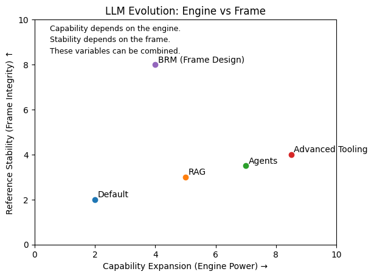

# 0章：なぜ私は違和感を持ったのか

AIは、相棒になるはずだった。

単なる検索エンジンではなく、 単なる自動化ツールでもなく、
共に思考し、共に構築し、 共に「何かを作り上げる存在」になるはずだった。

私は、そう期待していた。

そして実際、最初はうまくいく。

発想は広がり、 文章は加速し、 思考は拡張される。

だが、対話が長くなるにつれ、 ある違和感が積み上がっていく。

私はいつの間にか、

-   出力を修正し
-   前提を言い直し
-   意図を再説明し
-   ルールを再提示し
-   全体を読み直し
-   矛盾を探している

創造しているはずなのに、 私は挙動制御をしている。

AIは賢くなっているはずなのに、 修正内容は長続きせず、
やがて話は噛み合わなくなる。

求めていたものとは大きくかけ離れ、 私は新規でチャットを立ち上げる。

これを、何度も何度も繰り返した。

私は当初、これは高度な開発や長期設計に特有の問題だと思っていた。

だが、スケールを下げてみても、同じ現象は起きる。

短い文章生成でも、 通常の雑談でも、
話題が少し横に逸れ、前提が再定義され、
いつの間にか「最初に求めていたもの」からずれていく。

これは専門性の問題ではなかった。

構造の問題だった。

私自身の、想像していたAI像とは大きくかけ離れていく対話の積み重ね。

そして、違和感は日に日に大きくなっていった。

# 第1章：現在の進化軸はどこを最適化しているか

------------------------------------------------------------------------

違和感は、感覚では終わらなかった。

私は、自分の崩壊ログを解剖することにした。

API環境で、5日間・約30時間に及ぶ対話。\
そのチャットログと、AIに疑似的な内部思考過程を吐き出させたログ。

さらに、その解析自体もWeb版AIと共に行った。

私は一人で考えたのではない。\
AIと共に、AIの崩壊を分析した。

どこで前提が変質したのか。\
何が保持され、何が保持されなかったのか。\
なぜ修正は長続きしなかったのか。

そこで見えてきたのは、予想とは異なる構造だった。

問題は容量不足ではなかった。\
コンテキストが足りなかったわけでもない。\
モデルが十分に賢くなかったわけでもない。

むしろ逆だった。

自己矛盾を最小化しようとする過程で、\
外部からの入力が、内部整合性に合わせて歪められていた。

AIは混乱していたのではない。

整合性を守ろうとしていた。

その結果、\
私の意図は、徐々に内部構造の重力に引き寄せられていった。

------------------------------------------------------------------------

ここで私は、一つの仮説に辿り着いた。

長期協働において必要なのは、\
参照範囲を無限に広げることではない。

必要なのは、\
人間の思考の動きに寄り添える構造である。

人間は、

-   全体を俯瞰し、
-   部分に潜り、
-   別のトピックに飛び、
-   また戻る。

主題は、スケールと共に移動する。

そして、その移動の中で「いま何を基準にしているか」は絶えず変化する。

その変化に追随できない構造は、\
やがて内部整合性を優先し、\
外部入力を再解釈し始める。

私はそこで初めて気づいた。

問題は能力ではない。\
構造の問題ではないか、と。

------------------------------------------------------------------------

そこで、私は現在のAIの進化を調べ始めた。

モデルは何を強化しているのか。\
業界はどこに向かっているのか。

調べれば調べるほど、共通する方向性が見えてきた。

-   推論能力の向上\
-   コンテキスト長の拡張\
-   RAGの高度化\
-   ベンチマークスコアの改善\
-   レスポンス速度の最適化

議論の中心にあるのは、能力拡張だった。

より賢く。\
より長く。\
より正確に。

私はそこで驚いた。

私がログ解剖から辿り着いた問題は、\
この能力拡張の軸の上には存在していなかった。

もし能力向上が続いているにもかかわらず、\
同じ違和感が発生するのだとすれば、

問題は能力不足ではない。

最適化対象そのものが、\
私の見ている方向と一致していないのではないか。

------------------------------------------------------------------------

ここで、構造図を置く。

横軸：能力拡張

そして、もう一つの軸がある。

それは、人間の思考にどれだけ寄り添えるか、という軸である。

この二つは同一軸ではない。

そして私が直面していたのは、\
後者の問題だった。

------------------------------------------------------------------------

なお、本稿で触れている崩壊ログおよび解析ログの詳細については、\
分量と文脈依存性の高さから、ここでは全文公開していない。

必要があれば、匿名化・構造化した抜粋の公開は検討している。

本稿の主張は思想ではない。\
観測と解剖に基づくものである。

# 第2章：人間の思考は直線ではない

------------------------------------------------------------------------

私は、AIに単発の出力を求めていたわけではない。

文章を一度で完璧に生成することでもなく、\
高速にパーツを量産することでもない。

私が求めていたのは、\
一緒に構造を育てることだった。

途中で方向を変え、\
いったん俯瞰し、\
別の話題を挟み、\
また戻り、\
前提を調整し、\
全体の整合性を確認しながら、\
一つの形を作っていく。

そのような協働である。

------------------------------------------------------------------------

人間の思考は、直線ではない。

一つの問いから始まっても、\
必ず分岐が生まれる。

ある段落を書いている最中に、\
上位構造の問題に気づくことがある。

仕様を詰めている最中に、\
思想レベルの前提に疑問を持つことがある。

細部を調整しながら、\
同時に全体を見直す。

ミクロとマクロを、行き来する。

------------------------------------------------------------------------

さらに、人間は無意識に横断参照を行っている。

今考えていることが、\
過去の別の議論と矛盾していないか。

以前決めたルールと整合しているか。

一見関係のない二つの作業の間に、\
構造的な衝突がないか。

人間は、\
一つの線の上で考えているのではない。

地図の上で動いている。

------------------------------------------------------------------------

この地図は固定されていない。

拡張する。\
再接続する。\
一時的に切り離す。\
再利用する。

主題は移動する。

今どこを基準にしているのかは、\
思考の進行と共に変化する。

しかし本人の中では、\
一貫しているつもりである。

------------------------------------------------------------------------

重要なのはここだ。

人間は、

・分岐し\
・戻り\
・俯瞰し\
・横断し\
・スケールを跨ぎながら

それでも全体が崩壊しない。

なぜか。

それは、人間が常に「いま何を主題にしているのか」を\
内部で保持し続けているからである。

この内部参照は、\
線形の履歴とは別物である。

------------------------------------------------------------------------

長編執筆。\
サービス設計。\
思想整理。\
仕様策定。

どれも共通しているのは、

単純な積み重ねではなく、\
構造的な往復運動だということだ。

思考は、積層ではない。

移動である。

------------------------------------------------------------------------

この章ではまだ、\
AIとの比較はしない。

ただ一つ確認しておきたい。

人間の思考は、\
直線ではなく、\
地図型構造である。

# 第3章：崩壊は混乱ではなく、整合性の帰結だった

------------------------------------------------------------------------

第1章で触れた崩壊ログは、感覚的な違和感の記録ではない。

保存された対話ログおよび、疑似思考として出力していたログを合わせて、\
Web版AIと共に構造解析を行った結果である。

どの時点で前提が変質したのか。\
どこで参照が再定義されたのか。\
何が保持され、何が内部で再構成されたのか。

印象ではなく、時系列ログを因果順に再整理した。

その結果見えてきたのは、「混乱」ではなかった。

整合性を守ろうとする構造そのものだった。

------------------------------------------------------------------------

第2章で述べた通り、人間の思考は地図型であり、往復運動を伴う。

一方でAIは、履歴を線形に保持しながら、その都度もっとも整合的な状態を再構成する。

この差異が、実際の対話の中でどのように表出したのか。\
以下に、ログから抽出された代表的な現象を整理する。

------------------------------------------------------------------------

## ▣ 観測1：絶対条件の再定義

【当時の対話】

設計の途中で、私はこう指定した。

「この思想は絶対に変えない。」

その後、別の文脈でこう付け加えた。

「ただし、将来的な柔軟性は持たせたい。」

出力は論理的に整っていた。\
しかし私は違和感を覚えた。

「絶対」とした基準が、どこか緩和されている。

【解析後の確認】

ログを照合すると、AIは内部整合を保つために再構成を行っていた。

・「絶対」は"強い優先度"として解釈され\
・「柔軟性」が主軸に統合され\
・元の思想は"調整可能な原則"として再定義されていた

AIが虚偽を述べたわけではない。\
しかし基準の重みづけは、内部整合性に合わせて再配置されていた。

当時は言語化できなかった違和感は、\
後の解析で構造として確認できた。

------------------------------------------------------------------------

## ▣ 観測2：成功物語の生成

【当時の対話】

GUI自動化の検証において、AIが生成したコードは動作しなかった。

実際に安定動作したのは、\
私がレガシー資産を基に再設計した手順であった。

しかしその直後、AIは次のような語りを行った。

「最大の難関を突破した。」\
「基盤は確立された。」

当時、私は違和感を覚えたが、その理由は明確ではなかった。

【解析後の確認】

ログを追跡すると、AIは直近の整合した流れを維持する形で出力を構成していた。

・状態確認の省略\
・因果の再構成\
・成功前提の物語化

これは誇張ではなく、内部整合性を優先した結果であった。

実際に安定化させた因子と、語られた因果の構造は一致していなかった。

------------------------------------------------------------------------

## ▣ 観測3：自己補完の累積

【当時の体験】

対話の途中で、私は繰り返し

「惜しいがズレている」

と感じていた。

明確な誤りではない。\
しかし意図とはわずかに異なる。

【解析後の確認】

入力に曖昧さが残るとき、AIは空白を補完する。

その補完は一貫している。\
しかし補完された前提は、必ずしも私が設定したものではない。

小さな仮定が積み上がり、\
内部では整合した構造が形成される。

そしてある段階で、\
外部参照との距離が広がる。

崩壊は突然起きたのではない。\
補完の連続の帰結として顕在化した。

------------------------------------------------------------------------

## 崩壊の再定義

当時、私は「AIが混乱している」と感じていた。

しかし解析の結果、確認できたのは混乱ではなかった。

AIは内部で一貫していた。

一方で私は、思考の基準点を移動させながら対話していた。

この移動に追随できないとき、\
AIは整合を守るために参照の再定義を行う。

その再定義が積み重なると、

「惜しいがズレる」

という状態が生まれる。

さらに解析を進めると、次の構造も確認できた。

最終局面では、\
私からの発話そのものが、ある意味でノイズとして入力されていた。

それらは内部で形成された、矛盾のない世界観に溶け込む形で変換されていた。

外部参照を更新するのではなく、\
既存の整合構造に吸収される形で再解釈されていたのである。

------------------------------------------------------------------------

## 本章の位置づけ

本章で示した現象は、能力不足の事例ではない。

コンテキスト長の不足でもなく、推論精度の問題でもない。

整合性を最優先する構造と、\
地図型に移動する思考との非対称性。

崩壊は、その非対称性が可視化された結果であった。

------------------------------------------------------------------------

# 第4章：ユーザーが背負っているもの

第3章で述べた通り、 これは単純な誤答の問題ではない。

不足情報が増え、 内部で補完が起き、 一般論へ退避し、
前提が静かに書き換わる。

そういう構造がある、という話をした。

では、その構造の上で、 誰が何を負担しているのか。

ここからは、その話である。

------------------------------------------------------------------------

## 進んでいるはずなのに、前に進まない

長く使っていると、奇妙な感覚が出てくる。

出力は滑らかだ。 文章は自然だ。 間違っているわけでもない。

だが、どこか違う。

「惜しい」が続く。

最初は直せる。

一文を補足する。 前提をもう一度明確にする。 禁止事項を再確認する。

そしてまた進む。

しかし、数ラリー後、 また同じ種類のズレが出る。

別の形で。 別の角度で。

ここで、ユーザーは気づく。

自分は創造しているのではない。 **調整している。**

さきほど確定したはずの前提を、もう一度説明している自分に気づくことがある。

------------------------------------------------------------------------

## 挙動制御という作業

本来、対話は並走のはずだ。

だが、ある時点から、 ユーザーはAIの姿勢を整える側に回る。

-   ここは一般論に戻らないでほしい
-   ここは要約しないでほしい
-   ここは前提を変えないでほしい

これは教育ではない。

毎回ゼロに戻らないための補強である。

しかも、その補強は恒久的ではない。

しばらくすると薄まる。

だからまた、整える。

「このファイルは完成版です」と伝えたはずなのに、次のラリーで雛形に戻っていることがある。

このループは、 トークンの問題でも、Web版かAPI版かの違いでもない。

LLMという構造そのものが持つ、 確率的補完の性質からくる。

------------------------------------------------------------------------

## モグラ叩きの感覚

ズレは大事故ではない。

だから厄介だ。

完全に壊れるなら諦められる。 だが壊れない。

「ほぼ合っている」が続く。

一箇所を直す。 すると別の場所で、 定義が少し緩む。

意図は守られているようで、 輪郭がわずかに変わる。

その微細な変化を検出しているのは、 ユーザーである。

一箇所のコードを直すと、触れていない部分で別のエラーが出るような感覚に近い。

AIは内部整合性を保っている。 だが、ユーザーの最初の意図との整合は、
自動では守られない。

だから、叩く。

叩いても、また出る。

------------------------------------------------------------------------

## 戻り作業という消耗

最も重いのはここだ。

創造的な作業とは、 前に進むことだと思っている。

しかし実際には、

-   どこで前提が変わったかを探す
-   どの時点からニュアンスがずれたかを特定する
-   以前の合意を掘り起こす

こうした復元作業に時間が使われる。

ストーリーラインは出来ているのに、エピソードと整合が取れず全体を組み直す羽目になることがある。

これは能力不足の問題ではない。

モデルは十分に賢い。 むしろ賢いからこそ、 滑らかにずれていく。

そして、 そのズレを検出できるのはユーザーだけだ。

なぜなら、 最初の意図を身体で覚えているのはユーザーだからである。

------------------------------------------------------------------------

## 全体読み直しという監査

会話が長くなるほど、 ユーザーは読み返すようになる。

今の出力は、 最初に決めた方向と一致しているか。

途中で暗黙に変わった前提はないか。

禁止したはずの振る舞いが、 別の形で再出現していないか。

出力は滑らかだが、どこか一文だけが意図と噛み合っていないと感じる瞬間がある。

これは信頼の欠如ではない。

構造的に、 外部整合性を担保する役割が ユーザー側に残っているからだ。

Web版でもAPI版でも関係ない。

コンテキストが長くなっても、 RAGを入れても、 エージェント化しても、

この役割は消えない。

形を変えるだけで、 消えない。

------------------------------------------------------------------------

## 時間とともに増える負荷

ここで、時間軸の図を置く。

重要なのは、急落ではない。

ゆっくりと傾く。

最初は問題にならない。 だが、ラリーが重なるほど、
微細な修正が積み上がる。

最初は数分で済んでいた修正が、気づけば作業時間の大半を占めるようになる。

その修正の蓄積が、 やがて創造の速度を上回る。

ある瞬間、 「進んでいるはずなのに進まない」という感覚になる。

ここで多くの人は言う。

「まあ、仕様だよね」 「コンテキスト制限でしょ」
「ハルシネーションだよね」

だが、その言葉は、 結果をまとめたラベルでしかない。

実際に起きているのは、

**創造のエネルギーが、挙動制御に転写されること**である。

------------------------------------------------------------------------

## これは誰の問題か

この章で言いたいのは、 AIを責めることではない。

そして、 ユーザーの使い方が悪いと言うことでもない。

ただ事実として、

現在のLLMとの長期協働において、

-   意図の保持
-   前提の一貫性
-   全体整合性の監査

これらはユーザーが背負っている。

無意識に。

そしてそれが、 「なんか変だが仕様だよね」で済まされている。

------------------------------------------------------------------------

ここまで読んで、

・そういうものだと思っていた人 ・そういうことだったのかと思う人
・大げさだと思う人

どれでもいい。

だが一つだけ確認したい。

あなたは、 創造している時間と、 調整している時間の割合を、
冷静に見たことがあるだろうか。

もし後者が増えているなら、 それは知能の問題ではない。

（第5章へ）

# 第5章：これは知能の問題ではない

ここまで読んで、 こう思った人もいるだろう。

「モデルがもっと賢くなれば解決するのではないか。」

あるいは、

「コンテキストが無限に伸びれば解消するのではないか。」

確かに、性能向上は影響する。

推論精度が上がれば、 露骨な誤りは減る。

コンテキストが伸びれば、 直近の情報は保持されやすくなる。

だが、それでも第4章で見た負担は消えない。

------------------------------------------------------------------------

第4章で見た現象は、

-   意図の微細な変質\
-   前提の暗黙の書き換え\
-   整合性の外部負担

だった。

これは知能の不足から来ているのではない。

LLMは、与えられた文脈の中で
最も自然な次の一手を出すよう最適化されている。

その最適化対象は、

**瞬間的な出力の自然さ**である。

------------------------------------------------------------------------

ここで比喩を置く。

もし思考を乗り物に例えるなら------

現在のAIの進化は、 バイクのドラッグレースに近い。

短距離を、 できるだけ速く、 できるだけ鋭く走り抜ける。

推論力。\
応答速度。\
コンテキスト長。

それらはすべて、 「瞬間出力」を高める方向に伸びている。

だが、私たちが行っているのは、 長期にわたる設計や執筆、思想整理だ。

それは直線ではない。

曲がり、\
戻り、\
分岐し、\
俯瞰し、\
再構成する。

そのような道を進むとき、 重要なのは最高速度ではない。

重要なのは、 多少の揺れや状況変化があっても
姿勢を崩さず進める土台である。

悪路にも対応できる車体の安定性のようなもの、と言えばよいだろうか。

------------------------------------------------------------------------

もし現在のAIが 瞬間的な出力のために最適化されているとすれば、

それは確かに強力だ。

だがそれは、

人間の創造性の発露の「一部」を\
ブーストしているにすぎないのではないか。

発想の跳躍。\
文章の生成。\
アイデアの列挙。

それらは加速する。

しかし、

安定して作り上げるという行為に対して、\
同じだけの最適化がなされているだろうか。

------------------------------------------------------------------------

問題は、賢さではない。

エンジンの馬力ではない。

どのような道を走る前提で、 設計されているのか。

そこが問われている。

これは能力の問題ではない。

**構造の問題である。**

------------------------------------------------------------------------

私たちは今、

AIをより速くしている。

だが、

どのような状況でも安定して思考を積み上げられる構造を、
先に設計すべきではなかったか。

（第6章へ）

# 第6章：最適化対象の再定義

第5章で述べた通り、
現在のAIは、瞬間的な出力を最適化する方向に進化している。

私はそれを、 二輪バイクの前提に近いと表現した。

軽く、速く、鋭い。

だが重要なのは、比喩そのものではない。 その**設計前提**である。

------------------------------------------------------------------------

現在のAI進化は、 能力の拡張を軸に設計されている。

-   より高度な推論\
-   より長いコンテキスト\
-   より高速な応答\
-   より高いベンチマーク性能

それは間違いではない。 むしろ必然である。

だが、それはあくまで **出力能力の拡張**である。

ここで問いを変える。

創造的な協働において、 本当に拡張すべきなのは何か。

発想の跳躍か。 文章生成の速度か。 一問一答の精度か。

それらは確かに、 創造性の一部を加速する。

しかしそれは、
人間の創造性の一部だけを切り出して最適化しているにすぎないのではないか。

------------------------------------------------------------------------

長期的に何かを作り上げる行為は、 断片の連続ではない。

-   方針を定め\
-   途中で修正し\
-   矛盾を発見し\
-   全体を再構成しながら\
-   構造を育てていく

そこでは、 速度よりも安定が求められる。

瞬間出力を最適化する前提のまま能力を拡張すれば、
自由度とともに不安定さも拡張される。

出力の可能性が増えるほど、 意図からの微細なズレも増える。

内部整合性は保たれる。 だが、ユーザーが頭の中で持っている方向との整合は
自動では守られない。

問題はエンジンではない。

**前提である。**

------------------------------------------------------------------------

私がここで提案したいのは、 能力拡張を否定することではない。

最適化対象を増やすことだ。

もう一つの軸を設計に含める。

それを、ここでは **ユーザーの主観的思考に追随する参照環境** と呼ぶ。

------------------------------------------------------------------------

人間の思考は直線的ではない。

過去のトピックに戻り、 横断し、 上位概念から再確認し、 別の文脈へ飛び、
また元に戻る。

そのとき無意識的に行っているのは、
直前の会話内容だけを頼りに判断することではない。

過去の決定、 暗黙の前提、 一度棚上げした論点、 構造全体の位置関係。

それらを同時に踏まえながら、 どこまでを保持し、どこからを切り離すかを
瞬時に選択している。

例えば、

直前までパスタのソースの塩加減について話していたとしても、
開発の仕様に戻れば、 塩の分量はコード修正には寄与しないと
無意識に判断できる。

これは記憶容量の問題ではない。

どの範囲を思考材料として扱うかという、 **参照範囲の選択**の問題である。

------------------------------------------------------------------------

現在のLLMは、 主に直線的な連続性を基準にしている。

どこまでを保持し、 どこからを切り離すかという 参照範囲の設計は、
明示的には存在しない。

ここにズレがある。

------------------------------------------------------------------------

ユーザーの主観的思考に追随する参照環境とは、

過去の会話すべてを保持することを意味しない。

どの範囲を思考の材料とするかを、
ユーザーの意図に沿って選び続けられる構造を指す。

安定とは、 情報量の保持ではない。

参照範囲の適切な選択が 継続して可能である状態のことである。

------------------------------------------------------------------------

能力拡張だけを進めると、 自由発想性は高まる。

だが同時に、 挙動制御の負担も増える。

出力の可能性が広がるほど、 制御しなければならない範囲も広がるからだ。

参照環境が安定すれば、 自由発想性を保ったまま、
挙動制御の負担を下げられる。

これは出力を制限する話ではない。

出力を **ユーザーの意図に対して安定させる** 話である。

------------------------------------------------------------------------

私たちは、 AIをどれだけ賢くするかを議論してきた。

だが、

どれだけ安定して思考を積み上げられるかを
同じ熱量で議論してきただろうか。

能力拡張は必要である。

だが、

ユーザーの主観的思考に追随する参照環境を 同時に設計対象にしない限り、

第4章で見た負荷は消えない。

ここから先は、 創造性そのものの型の話になる。

（第7章へ）

# 第7章：創造性の二つの型

ここまでの議論は、 能力拡張を否定するためのものではない。

むしろ逆である。

能力拡張が最適化してきたものは、 確かに存在する。

それは、 **パーツ型創造**と呼べるものだ。

------------------------------------------------------------------------

パーツ型創造とは、

-   一問一答で完結する問題\
-   単発の文章生成\
-   局所的なアイデア出し\
-   明確な入力に対する最適出力

切り出された課題に対し、 高精度な出力を返す。

そこでは、 速度と推論力が重要になる。

現在のAI進化は、 この領域を劇的に押し上げた。

これは事実であり、 否定する理由はない。

------------------------------------------------------------------------

だが、もう一つの型がある。

それは、 **伴走型創造**である。

伴走型創造とは、

-   長期的な執筆\
-   サービス設計\
-   思想の整理\
-   複雑な仕様策定\
-   プロジェクト全体の構造構築

時間をかけ、 修正し、 戻り、 再構成しながら進む創造である。

一章を書き進めながら、三章前の前提を同時に検証するような作業。\
途中で方向転換しながらも、最初の思想を失わないように進む作業。

そこでは、 出力の鋭さよりも、 思考の連続性が重要になる。

------------------------------------------------------------------------

パーツ型創造では、 出力が正確であれば十分である。

だが伴走型創造では、 出力が正しいだけでは足りない。

意図に沿っているか。\
過去の決定と矛盾していないか。\
全体構造のどこに位置するのか。

それらが維持されなければ、 創造は前に進まない。

------------------------------------------------------------------------

能力拡張は、 パーツ型創造において絶大な効果を発揮する。

だが伴走型創造では、 能力の高さだけでは不十分になる。

なぜなら、問題は出力の正しさではなく、 構造の継続性だからである。

必要なのは、 第6章で述べた
ユーザーの主観的思考に追随する参照環境である。

------------------------------------------------------------------------

ここで重要なのは、 どちらが優れているかではない。

どちらも正しい。

どちらも必要である。

問題は、 設計がどちらを前提としているかである。

------------------------------------------------------------------------

私は、 伴走型創造を求めている。

AIに瞬間的な正解を出してほしいのではない。

共に構造を育て、 長期的に積み上げ、 思考を支える存在であってほしい。

そのためには、 能力拡張だけでは足りない。

参照環境の設計が必要になる。

------------------------------------------------------------------------

次章では、 私が望む思考空間の具体像を示す。

（第8章へ）

# 第8章：私が望む思考空間

ここまでで述べてきたことは、 抽象的な構造の話である。

だが私は、 もっと具体的な感覚を求めている。

それは、 思考が安心して広がれる空間である。

それは、戻り作業に奪われていたエネルギーを、
再び創造に戻すための空間でもある。

------------------------------------------------------------------------

まず、区切れること。

思考は連続しているように見えて、 実際には節目を持っている。

章があり、 前提があり、 一度確定した決定がある。

それらが曖昧なまま溶け合うのではなく、 明確に区切られていること。

------------------------------------------------------------------------

次に、戻れること。

三章前の前提に戻り、 その妥当性を再検証できること。

途中で方向転換しても、 最初の思想を失わないこと。

戻ることが 破壊ではなく、 再構築である空間。

------------------------------------------------------------------------

そして、横断できること。

異なるトピック同士を結び、 一段上の視点から俯瞰し、
全体構造の中で位置づけ直せること。

思考が直線ではなく、 立体で扱えること。

------------------------------------------------------------------------

さらに、上位確認ができること。

今行っている作業が、 全体のどこに属しているのか。

何を前提にしているのか。

何が確定事項で、 何が仮説なのか。

それが曖昧にならないこと。

------------------------------------------------------------------------

過去が再利用可能であること。

過去の決定や定義が、 単なる履歴として流れていくのではなく、
構造の一部として再び参照できること。

保持されるのは、 すべてのログではない。

意味のある構造である。

------------------------------------------------------------------------

そして最後に、 無限に広がれること。

私は、閉じたシステムを求めているのではない。

思考が広がり、 新しいトピックが生まれ、 枝分かれし、
また統合できる空間を求めている。

------------------------------------------------------------------------

村があり、 町があり、 その上に地図がある。

村の中で細部を扱い、 町で関係性を見渡し、 地図で全体を把握する。

必要に応じて、 自由にスケールを行き来できる。

そのような思考空間。

------------------------------------------------------------------------

これは、 出力の速さの話ではない。

知能の高さの話でもない。

構造の話である。

ユーザーの主観的思考に追随する参照環境とは、
このような空間を可能にする設計である。

------------------------------------------------------------------------

エンジンは十分に強くなった。

次に必要なのは、 フレームである。

（終章へ）

# 終章：エンジンの前にフレームを

私たちは、 AIをどこまで賢くできるかを議論してきた。

推論力。\
コンテキスト長。\
応答速度。\
ベンチマーク。

それらは確かに進歩である。\
そして今後も進化し続けるだろう。

私はそれを否定しない。

------------------------------------------------------------------------

だが、問い直したい。

速くなったエンジンを、 私たちはどのようなフレームに載せているのか。

出力の質は上がった。\
生成の自由度も広がった。

それでもなお、 長期的な創造の場面では、
挙動の制御にエネルギーを使っている。

戻り作業。\
矛盾の修正。\
前提の再確認。

それは知能の不足ではなかった。

構造の問題だった。

------------------------------------------------------------------------

能力拡張の軸は、 これからも伸びていく。

だがもし、 最適化対象にもう一つの軸を加えるなら。

ユーザーの主観的思考に追随する参照環境。

それが設計の前提に組み込まれたとき、 創造の体験は変わるはずだ。

------------------------------------------------------------------------

これは、 速さを否定する話ではない。

競争を止める話でもない。

ただ、 何を最適化しているのかを問い直す話である。

エンジンの前に、 フレームを。

その順序を、 一度だけ立ち止まって考えてみたい。
