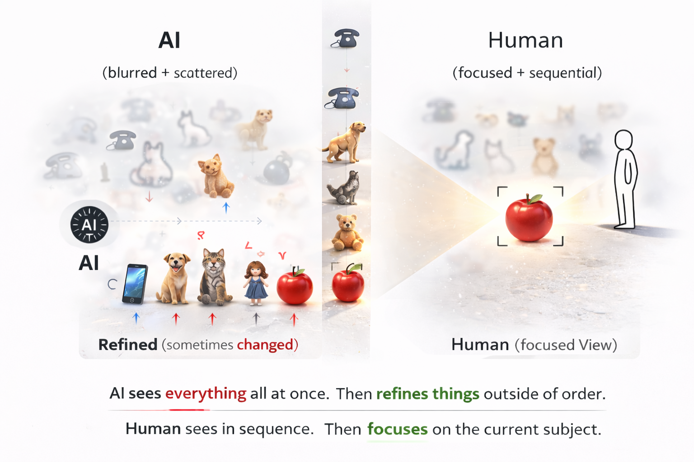

# AI Sees the Forest. Users See the Flower
### Why AI Conversations Need a Shared Perch

Large language models often reason over the full conversational context, while users usually focus on a very specific point of interest.

This difference in perspective can cause conversations with AI to gradually drift.

---

## The Forest Metaphor

When I think about conversations with AI, I often imagine a forest.

Most conversations begin with a single tree.

A technical question.  
A specification detail.  
A bug in the code.

At first, we are simply talking about one tree.

But as the conversation continues, that tree begins to expand.

Branches appear.  
The trunk grows thicker.  
Roots begin to connect with surrounding ideas.

What began as a single tree gradually reveals other nearby trees.

Another related concept appears.  
Then another.

Eventually the conversation forms a grove.  
And over time, a forest.

However, conversations do not only grow by adding new trees.

Sometimes a single tree simply grows larger.

More branches appear.  
More leaves grow.  
Flowers bloom.  
Perhaps fruit forms.

A topic deepens without necessarily moving to another one.

Conversations expand in two ways:

- New trees appear  
- Existing trees grow

This is where AI shows its unique capability.

AI fills in the unseen parts of a tree.

It estimates how the branches might spread.  
It imagines the thickness of the trunk.  
It infers structure that has not yet been described.

AI reasons with the entire forest in view.

When it sees one tree, it predicts what branches might exist around it and fills in the missing structure.

---

## A Difference in Perspective

Humans, however, often experience the forest differently.

Imagine a user walking through the forest and talking about a flower near their feet.

At that moment, the user is not looking at the entire forest.

They are looking at a single flower.

What they want to know now.  
What problem they are facing now.  
What they need to solve right now.

The user is talking about the flower.

This creates a difference in perspective.

> AI sees the forest.  
> The user sees the flower.

This raises an interesting question.

Is human thinking really sequential?

We often describe events in chronological order — past, present, and future.

But when we observe how thoughts actually move, the process looks different.

When we notice a flower, we explore the branch it grows from and then move toward another flower nearby.

Sometimes we even return to the first one.

Time still exists in the background.

But the movement of thought seems to be driven more by **what we are focusing on** than by time itself.

---

## The Mismatch Between Thought and Logs

Now consider how AI conversations are actually recorded.

AI conversations are stored as logs.

Messages are placed in chronological order, forming a single line from top to bottom.

In other words, the record of a conversation is **linear**.

But human attention does not move linearly.

We revisit earlier topics.  
Jump sideways to related ideas.  
Explore a branch, then return.

Thought spreads through a forest.

Conversation logs unfold along a single line.

And somewhere between those two structures, a mismatch appears.

If thinking resembles walking through a forest, then conversations need a **shared perch**.

When we walk through a forest, we stop at certain trees.

We examine the branches.  
Look closely at the flowers.  
Then move on.

But if we lose track of which tree we were discussing, the conversation quickly becomes confusing.

---

## Inference and Abstraction

Human conversations naturally maintain these reference points.

We know which topic we are discussing.  
Which branch of the discussion we are exploring.  
Which detail we are focusing on.

These shared reference points act as anchors for the conversation.

However, conversations with AI often lack this explicit structure.

AI looks at the forest.

The user looks at the flower.

Meanwhile the conversation continues to accumulate as a single linear log.

What happens then?

The reference point becomes unclear.

AI begins to infer the missing structure.

It predicts what branches might exist.

But this raises another question.

Is the tree inside the AI the same tree the user had in mind?

The parts the user never explicitly described must be inferred by the AI.

Over time, as the conversation continues and new topics appear, earlier trees gradually become more abstract.

Details of the branches fade.

The exact shape of the flowers disappears.

What remains is a generalized structure.

At that point, something subtle may have happened.

The tree imagined by the user and the tree reconstructed by the AI may no longer be the same tree at all.

---

## Search Problems vs Reference Problems

Many recent approaches to AI conversation focus on improving how quickly we can search the forest.

Techniques such as RAG significantly improve the ability to retrieve relevant information from large knowledge spaces.

However, conversations with users involve another challenge.

It is not only about finding trees in the forest.

It is also about knowing **which tree we are currently looking at**.

AI can scan the forest.

But during a conversation, identifying the current reference point often becomes a probabilistic guess.

Forests contain many similar trees.

Flowers can look alike.

And as conversations grow longer, earlier trees gradually become abstract memories.

Under those conditions, deciding whether two branches belong to the same tree or to different ones becomes increasingly uncertain.

If that is the case, improving search alone may not be enough.

We may also need structures that explicitly share **where we are currently perched**.

---

## The Perch

Perhaps before asking AI to become smarter, we need to give conversations a stable place to stand.

In a forest, we need to know:

Which tree we are perched on.

Which branch we are following.

Which flower we are looking at.

Sharing that reference point — that **perch** — may be one of the keys to making AI conversations more stable.

---

## Related Project

This essay describes a common problem in AI conversations:  
the loss of a shared reference point during long discussions.

The **Branching Reference Model (BRM)** explores a structural approach to stabilizing long AI collaborations by maintaining explicit reference anchors during conversation.

https://github.com/continuity-model/branching-reference-model
