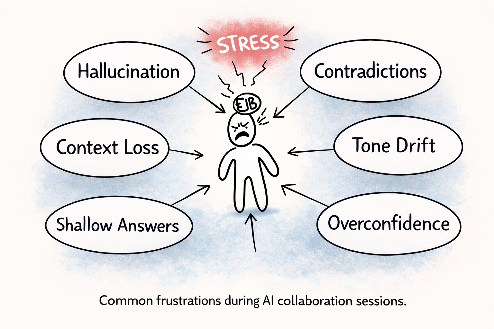

# なぜAIとの協働は崩れるのか
## Failure Patterns and Structural Countermeasures

AIとの協働は、しばしば次のような問題に悩まされます。

- さっき決めたことを忘れる  
- 説明がどんどん浅くなる  
- 文体が変わる  
- 自信満々で間違える  

これらは偶然ではありません。  
多くの場合、**同じ構造的パターン**によって発生します。

---

# 1. AI協働で起きる失敗

**AI協働でよく発生するストレスの例**

AIとの協働で発生する問題は、最初は偶然のように見えることが多いです。  
しかし詳しく観察すると、同じ種類の失敗パターンが繰り返し発生していることがわかります。

これらは偶然ではなく、  
**AIの生成構造に由来するパターンです。**

以下は、実際に観測される代表的な失敗パターンです。

---

## 症状分析の失敗

**観察された症状を整理する前に、原因診断に飛んでしまう**

例  

子どもが耳の痛みを訴える。

本来は状況を整理する必要がありますが、  
会話はすぐに診断へ進んでしまいます。

症状

- 耳の痛み  
- 発熱  
- 横になると機嫌が悪くなる  

タイムライン

- 発熱は2日前に始まった  
- 痛みは今日から始まった  

結果  

調査は観察ではなく、  
**仮定から始まってしまいます。**

---

## 文章作成の失敗

**圧縮による情報損失**

症状  

詳細な説明が要約され、平坦化される。

原因  

トークン制約と確率的圧縮。

---

**議論のドリフト**

症状  

議論が元の主張から徐々にずれていく。

原因  

整合性を優先する生成バイアス。

---

**文体のドリフト**

症状

- 語り口が変化する  
- 技術文が解説調になる  
- 著者の声が弱まる  

原因  

内部整合処理による文体の正規化。

---

## デバッグの失敗

**間違ったコード経路の修正**

症状  

パッチを当てても挙動が変わらない。

原因  

実行されているモジュールが別。

---

**仮説の洪水**

症状  

複数の原因仮説が同時に提示される。

原因  

カバレッジ最適化の挙動。

---

**パッチ蓄積崩壊**

症状  

複数の修正が同時に適用される。

原因  

検証されない変更が積み重なる。

---

## リサーチの失敗

**ゴーストソース**

症状  

存在しない引用が信頼できる情報のように現れる。

原因  

もっともらしい参考文献を生成してしまう確率補完。

---

**ソースの融合**

症状  

複数の情報源が1つの主張にまとめられる。

原因  

複数ソースが確率的に圧縮される。

---

**主張のドリフト**

症状  

主張が元の情報源から離れていく。

原因  

物語の整合性を優先する生成バイアス。

---

## 法解釈の失敗

**定義の無視**

症状  

定義された法律用語が日常言語として解釈される。

原因  

自然言語の一般化が正式定義を上書きする。

---

**適用範囲の無視**

症状  

条項が定義された範囲を超えて適用される。

原因  

文脈一般化による解釈の拡張。

---

**例外の欠落**

症状  

例外規定が解釈から抜け落ちる。

原因  

線形読解が条件構造を無視する。

---

## 仕様設計の失敗

**仕様崩壊**

症状

- 仕様が徐々に変化する  
- 用語が未定義になる  
- 暗黙の前提が増える  

原因  

明示的仕様境界が暗黙前提に置き換わる。

---

**設計先行崩壊**

症状  

仕様が固まる前に設計が始まる。

原因  

実装圧力が仕様整理を上書きする。

---

**トレーサビリティ崩壊**

症状  

元の要求仕様の出所が失われる。

原因  

要件と実装を結ぶ構造参照が存在しない。

---

## 評価の失敗

**根拠のない評価**

症状  

対象を参照しない一般的な評価が生成される。

原因  

証拠参照なしの評価生成。

---

**隠れた評価基準**

症状  

明示されていない基準で評価が行われる。

原因  

暗黙の評価基準。

---

**偽の具体性**

症状  

根拠のない数値や具体的主張が現れる。

原因  

確率生成による具体性の補完。

---

# 2. なぜこれが起きるのか

AI協働の不安定性には  
主に2種類があります。

- 初期ミスアライン  
- 長期コンテキスト崩壊  

---

## 初期ミスアライン

AI協働では、  
最初の回答の時点からズレが発生することがあります。

ユーザーがプロンプトで思考手順を指定していても、  
AIは確率生成によって

**「最も自然な回答」**

を優先する場合があります。

その結果、本来は

観察  
→ 仮説  
→ 検証  

という順序が必要な場面でも

原因説明  
→ 解決策  

が先に生成されてしまうことがあります。

これは能力不足というより  
**確率生成の性質によるミスアライン**です。

---

## 長期コンテキスト崩壊

長い会話では、  
初期プロンプトの影響が徐々に弱まっていきます。

参考  

→ [Anchoring Theory — Dissolving Prompts](https://github.com/continuity-model/branching-reference-model/blob/main/core/EN/Anchoring_Theory_Dissolving_Prompts_EN.md)

この現象は

**Prompt Dissolution（プロンプト溶解）**

と呼ばれます。

結果として

- 初期指示の影響低下  
- コンテキスト再解釈  
- 確率生成の支配  

が発生し、推論構造がドリフトします。

---

# 3. 解決アプローチ

プロンプトだけでは  
AI協働を安定させることはできません。

どれだけ良いプロンプトでも  
長い会話では徐々に弱まります。

必要なのは

**構造化された参照アンカー**

です。

つまり

- 参照点を明示する  
- 推論範囲を制御する  
- 会話構造を維持する  

という仕組みです。

---

# 4. Stable Modes

Stable Modesは  
これらの失敗パターンを防ぐために設計された  
構造化運用モードです。

それぞれのモードは  
特定の協働問題領域に対応しています。

---

## Symptom Stable
→ [Symptom Stable](./symptom-stable_JP.md)

---

## Writing Stable
→ [Writing Stable](./writing-stable_JP.md)

---

## Debugging Stable
→ [Debugging Stable](./debugging-stable_JP.md)

---

## Research Stable
→ [Research Stable](./research-stable_JP.md)

---

## Legal Stable
→ [Legal Stable](./legal-stable_JP.md)

---

## Spec Stable
→ [Spec Stable](./spec-stable_JP.md)

---

## Evaluation Stable
→ [Evaluation Stable](./evaluation-stable_JP.md)

---

# 5. 実務的な意味

AI協働の崩壊は偶然ではありません。  
多くの場合、同じ構造パターンが繰り返し発生します。

そのため

**「たまたまうまくいくAIセッション」**

に依存することは  
安定した協働方法とは言えません。

必要なのは

**会話構造の規律**

です。

Stable Modesは  
この規律を維持するための  
運用構造を提供します。

つまりAI協働を

**偶然ではなく再現可能なものにする**

ためのアプローチです。
